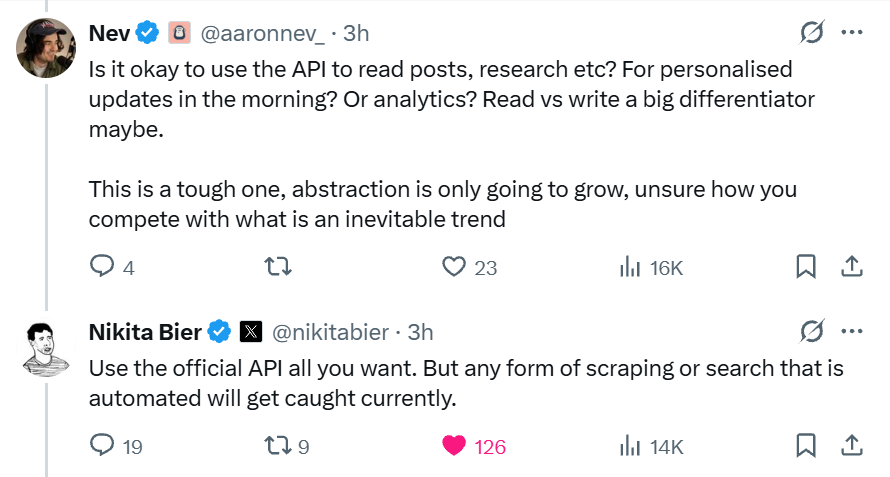

# X (Twitter) Personal Analytics Skill

Give your AI agent eyes on your X account — analytics, posts, mentions, followers — for ~$1-2/month. Official API only, no scraping, no suspension risk. Built after [@nikitabier confirmed](https://x.com/nikitabier/status/2022502068486074617) automated scraping will get accounts suspended — this skill uses only the official X API v2.



Works with any AI agent — [OpenClaw](https://openclaw.ai), Claude Code, Codex, or anything that reads a [SKILL.md](http://skill.md/).

## What It Does

- **Timeline**: Your recent posts with full engagement metrics (impressions, likes, RTs, replies, quotes, bookmarks)
- **Mentions**: Who's replying to or quoting you, with their follower count
- **Follower Tracking**: Daily follower count with delta tracking over time
- **Accountability**: Checks if you're spending too much time on X when you should be working
- **Cost Optimized**: Persistent local store + incremental fetching = minimal API costs (~$1-2/mo)

### Why Not Scraping / Bird CLI?

X is actively detecting and suspending accounts that use automated scraping, cookie-based tools, or browser automation. The official API is the only safe path for programmatic access. This skill uses OAuth 1.0a with your own API keys — no cookies, no headless browsers, no risk.

## Setup

See **[SETUP.md](SETUP.md)** for a detailed step-by-step guide including X Developer Console walkthrough, API credit loading, and budget configuration.

Quick version:

```bash
# 1. Clone the skill
cd ~/.openclaw/workspace/skills  # or wherever you keep skills
git clone https://github.com/aaronnev/x-twitter-skill.git x-twitter

# 2. Run setup (requires uv: curl -LsSf https://astral.sh/uv/install.sh | sh)
uv run scripts/x_setup.py

# 3. Test it
uv run scripts/x_user.py me
```

## Cost

X API v2 uses pay-per-use pricing:
- Tweet reads: ~$0.005 per request
- User reads: ~$0.01 per request

This skill minimizes costs with:
- **Persistent store**: tweets fetched once, stored forever locally
- **Incremental fetching**: `since_id` means only new tweets are fetched
- **Daily budget guard**: blocks requests when daily limit is hit
- **Budget tiers**: lite ($0.03/day), standard ($0.10/day), intense ($0.25/day)

Typical monthly cost: **~$1-2** for daily briefings.

## Commands

| Command | What It Does | API Cost |
|---------|-------------|----------|
| `x_timeline.py recent` | Recent posts + engagement | ~$0.005 |
| `x_timeline.py top` | Top posts from local store | $0 |
| `x_timeline.py activity` | Accountability check | ~$0.005 |
| `x_timeline.py refresh ID` | Update one tweet's metrics | ~$0.005 |
| `x_mentions.py recent` | Recent mentions/replies | ~$0.005 |
| `x_mentions.py recent --context` | Mentions + parent tweets | ~$0.005-0.03 |
| `x_user.py me` | Your profile stats | ~$0.01 |
| `x_user.py me --track` | Profile + save follower delta | ~$0.01 |
| `x_user.py lookup USER` | Any user's profile | ~$0.01 |
| `x_setup.py --spend-report` | Weekly spend summary | $0 |
| Any command `--dry-run` | Preview cost without API call | $0 |

## How It Works

### Architecture

The skill talks directly to the X API v2 using OAuth 1.0a (your API keys). No middlemen, no third-party proxies.

```
You ask your agent → Agent reads SKILL.md → runs the right script via uv
                                                      ↓
                                              Script hits X API v2
                                                      ↓
                                         Response stored locally (data/)
                                                      ↓
                                           Clean output → agent → you
```

### Cost Optimization (3 layers)

1. **Persistent local store** — Every tweet/mention gets saved to `data/tweets.json` on first fetch. Subsequent requests serve from local storage. A tweet is never re-fetched unless you explicitly ask (`refresh`).

2. **Incremental `since_id` fetching** — Each fetch stores the newest tweet ID. Next time, the API only returns tweets newer than that. First run pulls your recent history; after that, only new posts cost anything.

3. **Daily budget guard** — Tracks every API call in `data/usage.json`. If your daily spend hits the limit, the skill warns you and stops making calls (override with `--force`).

### Accountability Mode

`x_timeline.py activity` checks your recent posting activity and tells the agent:
- When you last posted
- How many posts today / this hour
- Whether you've been spending too much time on X

The agent can use this to nudge you back to work.

## File Structure

```
x-twitter/
├── SKILL.md              # OpenClaw skill manifest
├── AGENTS.md             # AI agent reference (machine-readable)
├── SETUP.md              # Step-by-step setup walkthrough
├── README.md             # This file
├── LICENSE               # MIT
├── .gitignore
├── scripts/
│   ├── x_setup.py        # Credential setup, validation, spend reports
│   ├── x_timeline.py     # Posts + engagement + accountability
│   ├── x_mentions.py     # Mentions and replies
│   └── x_user.py         # Profile info + follower tracking
└── references/
    └── x-api-quickref.md # API endpoint reference

# Config (per-user, NOT in repo):
~/.openclaw/skills-config/x-twitter/
├── config.json           # Credentials + settings (0600 permissions)
└── data/
    ├── tweets.json       # Persistent tweet store
    ├── mentions.json     # Persistent mention store
    └── usage.json        # Daily API cost tracking
```

## Prerequisites

- [uv](https://astral.sh/uv) — Python package runner (handles dependencies automatically)
- X API developer account with credits loaded at [developer.x.com](https://developer.x.com)
- Any AI agent that reads [SKILL.md](http://skill.md/) ([OpenClaw](https://openclaw.ai), Claude Code, Codex, etc.)

## Credits

Built by [@aaronnev_](https://x.com/aaronnev_) with [Claude Code](https://claude.ai/code) (Claude Opus 4.6).

Uses [tweepy](https://github.com/tweepy/tweepy) for X API v2 access and [uv](https://github.com/astral-sh/uv) for zero-config Python script execution.

## License

MIT
